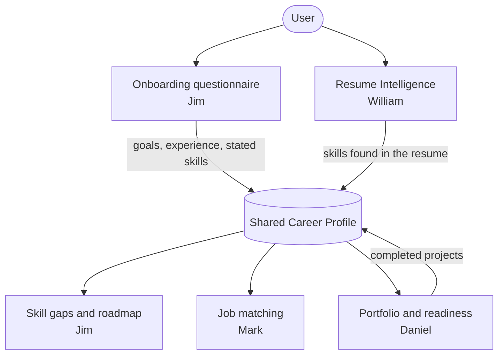
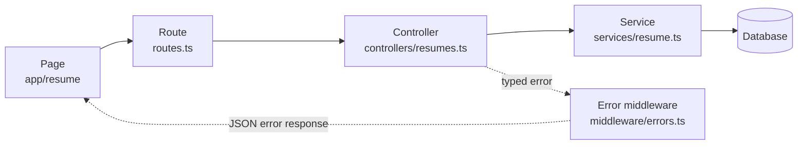

# CareerLM Architecture

High-level view of how CareerLM is put together and how the four subsystems fit around one shared Career Profile.

For endpoint naming, response and error shapes, auth headers, and database naming, see [CONVENTIONS.md](../CONVENTIONS.md). This document covers structure, not conventions.

## 1. System structure

Four parts, each in its own folder in this repo.

| Layer | Folder | What it does |
|---|---|---|
| Frontend | `site/career-buddy-site` | Next.js app. Pages, forms, and rendering. No business logic. |
| API | `api` | Express service. Routes, controllers, services, and errors. |
| Database | `api/src/database` | Client and migrations. Not connected yet, see KAN-18. |
| Infrastructure | `infra` | Terraform definitions. |

In development the frontend runs on port 3000 and the API on port 8000. The frontend forwards `/api/*` to the API through a rewrite in `next.config.ts`, so browser code can call relative paths.

## 2. The four subsystems

Each member owns one vertical slice and builds the frontend, backend, and data work for it.

| Owner | Subsystem | Responsibility |
|---|---|---|
| Jim Alvarez | Career Profile & Roadmap | Onboarding questionnaire, the user's profile, skill-gap analysis, roadmap generation |
| William Wang | Resume Intelligence | Resume upload, text extraction, skill extraction, AI resume feedback |
| Mark Gaballa | Job Intelligence & Matching | Job data, job skill extraction, match scoring, ranking, filters |
| Daniel Lee | Portfolio & Career Readiness | Project portfolio, progress tracking, readiness score, dashboard |

## 3. The shared Career Profile

The Career Profile is the one record every subsystem reads from or writes to. It holds the user's target role, experience level, skills, and progress.

Jim owns the Career Profile schema, since Career Profile is his subsystem. Anyone who needs a new field on it asks him rather than adding it directly.

Two subsystems write skills into the profile: onboarding collects what the user says they know, and Resume Intelligence adds what the resume shows. Roadmap, job matching, and portfolio all read from it.

That creates two problems the team has to agree on.

- **One skill format.** If one side normalizes `JS` to `JavaScript` and another does not, matching scores stop meaning anything.
- **What happens when the two sources disagree.** A user may not list a skill in onboarding that their resume clearly shows, or the other way around. The simplest rule is to keep both sets and record where each skill came from, instead of one overwriting the other.

## 4. How subsystems talk to each other

Subsystems talk through agreed API endpoints and shared types in `api/src/types`. They do not import each other's controllers or services directly.

The point is that each owner can change how their own subsystem works internally without breaking anyone else, as long as the shape of the data going in and out stays the same.

## 5. Life of a request

Using a resume upload as the example. Every subsystem follows the same path.

- **Route** registers the path and any upload middleware.
- **Controller** handles HTTP: validates the request, calls a service, shapes the response.
- **Service** holds the logic and knows nothing about HTTP, so it can be tested on its own.
- **Errors** are thrown as typed error classes from `errors/index.ts`. One middleware turns them into the shared JSON error shape, so no controller writes its own error response.

## 6. Open items

- **Database is not chosen yet.** `database/client.ts` is still a stub and KAN-18 is blocked until the team picks Supabase or plain Postgres. The existing migrations are raw SQL, so either option works.
- **No test framework in `api` yet.** The team still needs to pick Jest or Vitest before KAN-17 and the other test tickets can start.
- **Auth is not wired in.** Until it is, endpoints are not tied to a logged-in user.
